# 05. 기초 개발 지식

## 게임의 기본 구성 요소

 게임은 여러 구성 요소들의 서로 간의 상호 작용에 의해 동작합니다. 이 상호 작용의 과정은 전적으로 게임을 개발하는 도구, 엔진에 의해 결정됩니다. 그 중에서도 `GameMaker`는 꽤나 단순한 엔진에 속합니다. `GameMaker`에서는 `객체 (Object)`라는 물건들이 `룸 (Room)`이라는 공간 안에서 게임 내에서 온갖 일을 합니다. 객체는 어떤 사물을 컴퓨터 안에서 구현한 거라고 보시면 됩니다. `GameMaker`는 객체 지향 엔진이라는 것을 표방하여 이 객체들끼리 상호 작용을 주 작동 원리로 삼고 있습니다. 예를 들어서 사람의 입력을 받아서 움직이는 플레이어도 객체이며, 플레이어 주변에 돌아다니는 NPC도 객체, 플레이어가 밟고 있는 땅도 객체입니다. 이 객체들의 겉모습을 이루는 자원을 `스프라이트 (Sprite)`, 객체들이 활동하는 무대를 `룸 (Room)`이라고 합니다.

### 스프라이트

 

 객체의 겉모습을 이루는 그림과 그 그림의 속성의 집합을 스프라이트 (Sprite)라고 합니다. 스프라이트는 `GameMaker` 내의 다양한 곳에서 이용됩니다. 스프라이트는 단순히 그림일 뿐이라 정말 기본적인 요소는 아니지만 일반적으로는 꼭 필요한 요소로 취급됩니다.

### 스프라이트 편집기

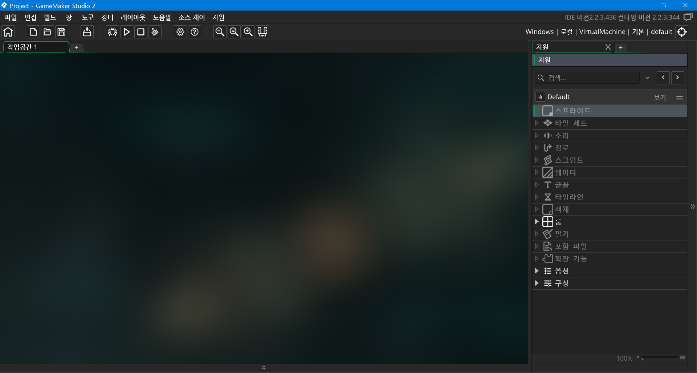

 스프라이트를 만들려면 먼저 스프라이트 자원을 추가해야 합니다. 우측의 자원 목록에서 스프라이트 항목을 마우스 오른쪽 클릭 하시면 새 스프라이트를 추가할 수 있는 메뉴가 나옵니다.

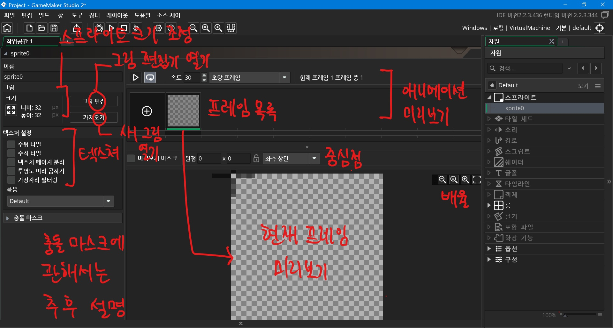

 스프라이트 편집기에선 불러온 그림에 여러가지 속성을 붙여 관리할 수 있습니다. 모든 스프라이트는 해상도와 고유한 중심점, 텍스처, 충돌 마스크를 가집니다.

- **해상도**는 그림의 크기를 의미합니다.
- **중심점**은 스프라이트의 중심을 의미합니다. 스프라이트의 배치, 회전 등은 모두 이 점을 기준으로 이루어집니다.
- **텍스처**는 게임에 스프라이트를 불러온 정보를 의미합니다. 그림은 jpg, png같은 원래 파일을 말하고, 스프라이트는 그림에 속성을 붙여서 자원으로서 관리하는 것이라면 텍스처는 그 스프라이트를 게임에 불러온 상태를 말합니다.
- **충돌 마스크**는 스프라이트를 객체에 부여했을 때 그 객체의 충돌이나 위치 검사에 이용할 스프라이트의 크기 범위입니다. 충돌 마스크가 스프라이트보다 크거나 작게 해서 보이는 것과 충돌 범위를 다르게 할 수도 있습니다.

#### 그림 불러오기

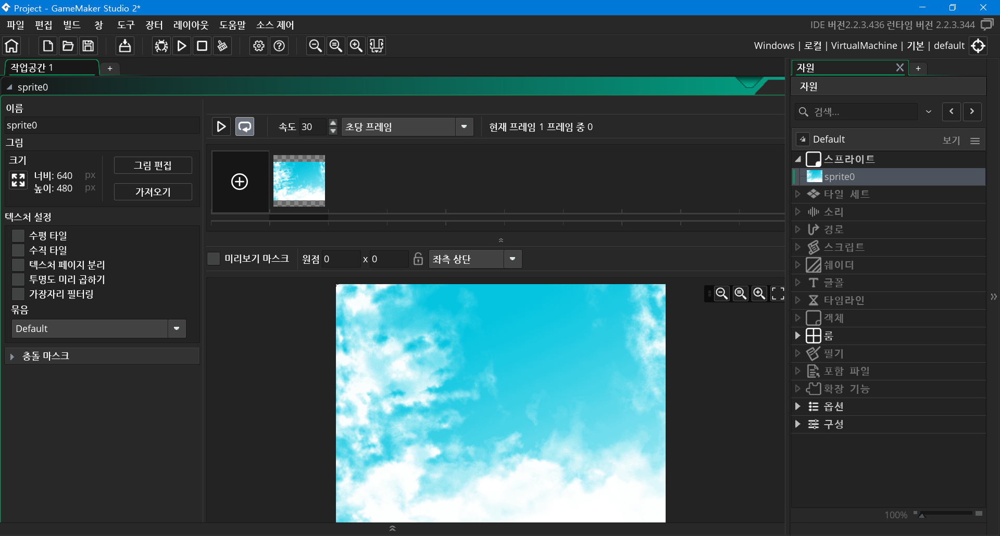

 버튼 중에 왼쪽 상단의 **가져오기 (Import)**를 누르시면 새로운 그림을 가져올 수 있습니다. 이렇게 가져온 그림이 스프라이트의 새로운 그림이 됩니다. 주의하실 점은 새 그림을 가져오면 그 전에 설정했던 스프라이트 속성들은 모두 초기화 됩니다. 주의하세요.

#### 용지 크기 바꾸기

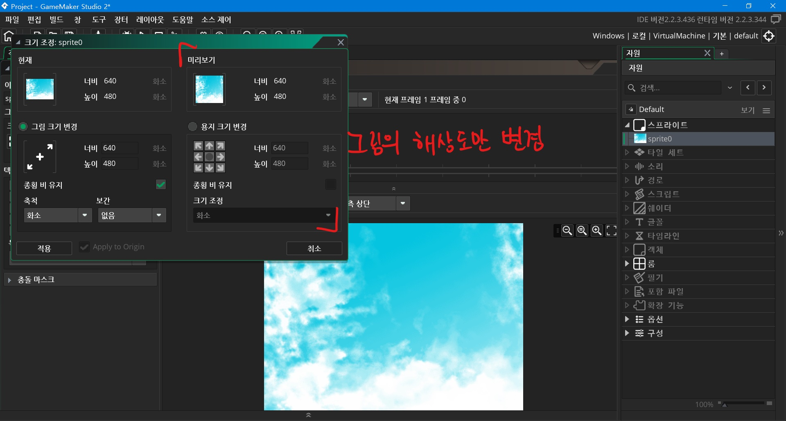

 한편 맨 왼쪽 끝의 방사 무늬 버튼을 누르시면 스프라이트 크기 조정 창이 열립니다. 이 메뉴에서는 스프라이트의 비율이나 용지의 크기를 바꿀 수 있습니다. 그림의 내용물은 그대로 두고 그림의 해상도만 바꾸고 싶으시다면 **용지 크기 변경**을 선택하시면 됩니다. 크기와 함께, 크기 조정 후에 나머지 그림이 새롭게 조정된 용지의 어느 쪽에 위치할 지 정할 수 있습니다. 이 부분은 직접 해보는 것을 추천해드립니다.

#### 그림 비율 바꾸기

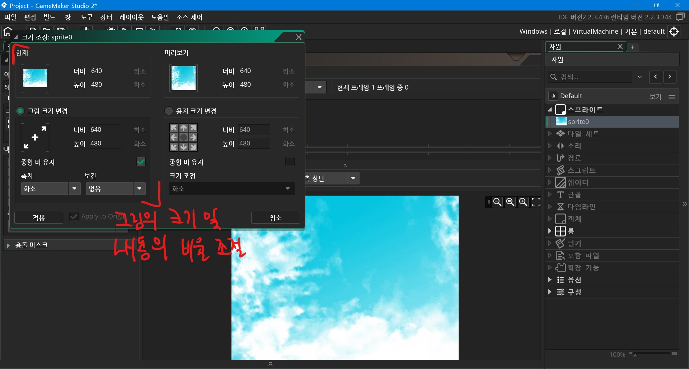

 그리고 좌측 메뉴에서는 그림의 비율을 조절할 수 있습니다.  그림의 해상도와 함께 그림 내용물도 같이 크기가 바뀝니다. 크기와 함께 비율이 조절될 때 사용할 보간 방식도 정해 줄 수 있습니다. 보간 속성을 정하지 않으면 도트처럼 깨져서 나옵니다.

#### 애니메이션

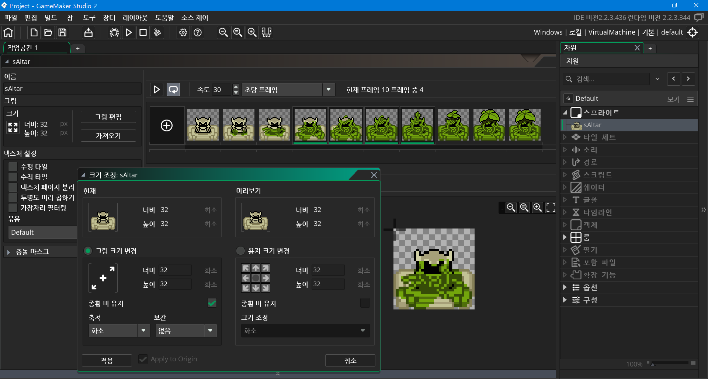

 `GameMaker`의 스프라이트는 애니메이션 기능을 지원합니다. gif나 webp를 쓰는 건 아니고 png 여러 장을 한 스프라이트에서 관리하면서 이어 붙여 보여 주는 것입니다. 애니메이션 스프라이트의 속성을 변경하면 모든 프레임에 적용됩니다. 예를 들어 용지의 크기를 변경하면 프레임 전부다 크기가 변합니다.

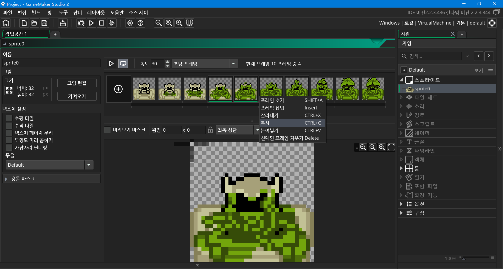

 파일 탐색기에서 여러 파일을 선택하는 것처럼 Ctrl, Shift, Alt 키로 여러 장을 선택하실 수 있습니다. 이때 삭제, 복사, 잘라내기, 컨텍스트 메뉴 등의 동작은 선택된 모든 프레임에 적용됩니다.

#### 그림 편집기

* 이 부분에 대한 요약은 [링크](#단점)에 있습니다.

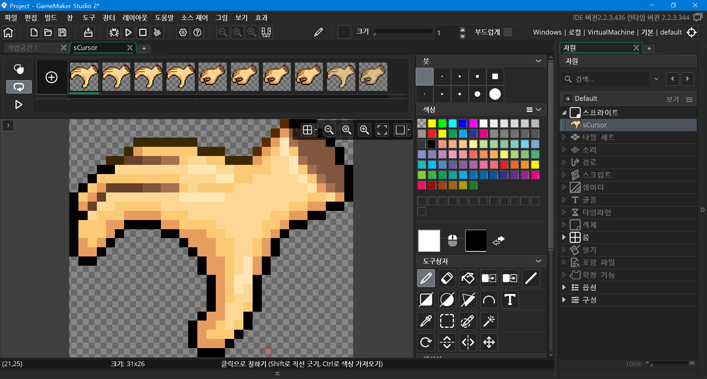

 그림을 불러온 스프라이트의 프레임을 더블 클릭하거나, 좌측 상단의 **그림 편집 (Edit Image)**을 누르시면 그림 편집기가 뜹니다. 레이어와 애니메이션 부분을 제외하면 그림판과 거의 같습니다.

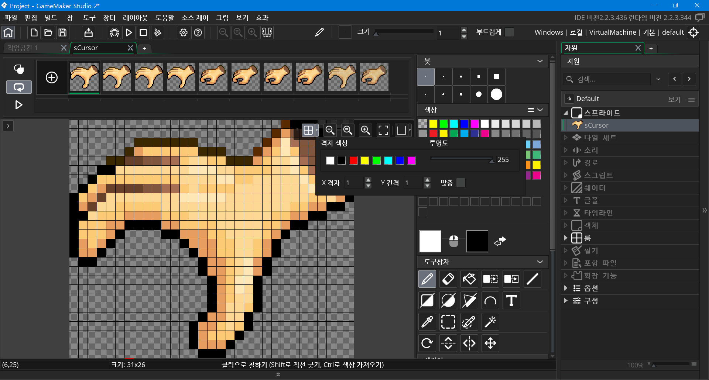

 작은 제어 창에서는 그림을 확대 및 축소할 수 있으며, 다양한 격자 맞춤 설정을 제공합니다.

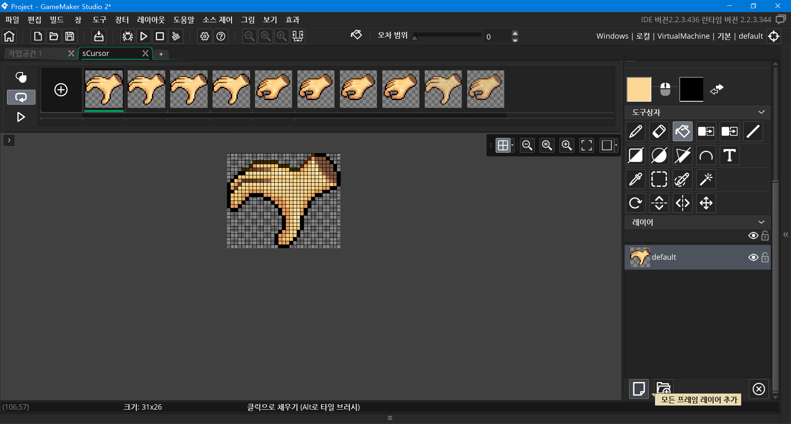

 또한 레이어 기능도 제공합니다. `GameMaker Studio 2`에서 예전 버전과 비교해서 손꼽히는 장점이 레이어를 사용할 수 있다는 겁니다.

##### 복사 붙이기


 그림 편집기에서 가장 독특한 부분이라고 할 수 있습니다. `GameMaker`의 그림 편집기는 복사한 그림을 클립보드 말고도 우측의 붓 팔레트에 저장해놓습니다. 이 복사된 그림들을 마치 붓처럼 사용할 수 있습니다. 다른 프로그램에서 볼 수 있는 패턴 붓과 비슷한 것입니다.

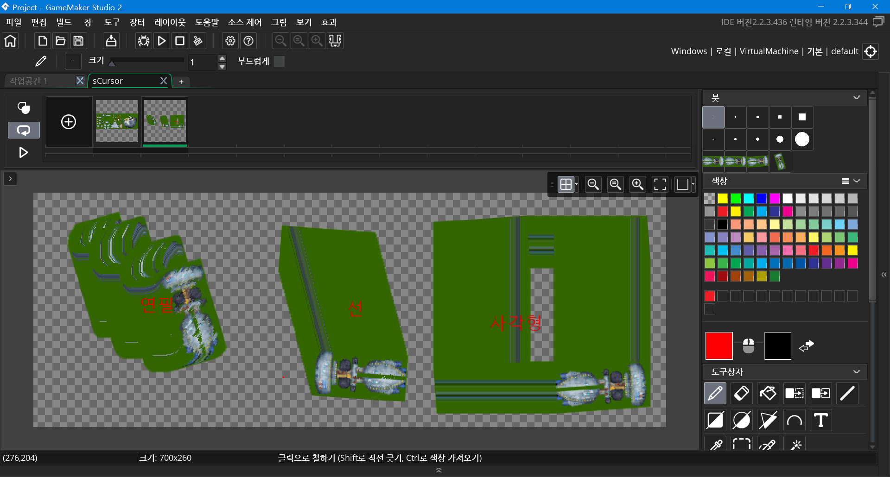

 이렇게 획을 그을 수 있는 도구라면 전부 사용할 수 있습니다.

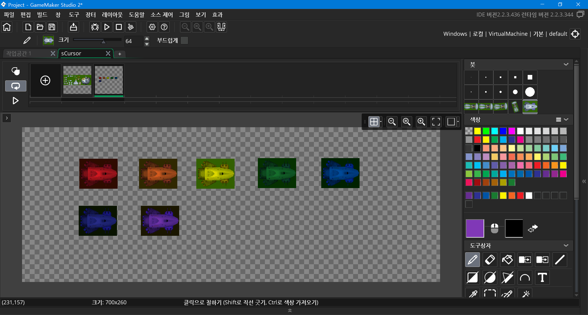

 `GameMaker Studio 2`에선 색 혼합 / 색조 변경 기능이 사라졌는데요, 대신에 색 팔레트에서 다른 색을 고르고 그리는 것으로 붙이기 할 그림에 색을 섞어 줄 수 있습니다.

#### 단점

 `GameMaker Studio 2`로 넘어오면서 인터페이스의 대격변이 일어났습니다. 누구나 IDE의 첫 인상은 세련되고 멋진 인상을 줍니다. 그런데 겉만 번지르르 하지 실상은 너무 불편해서 적응에 한 주가 걸리는 정도입니다. 그 중에서도 `GameMaker Studio 2`의 스프라이트 편집기와 그림 편집기가 특히 구립니다.  마치 스마트폰의 노치처럼 자꾸 봐서 익숙해져야 적응이 됩니다. 좋지 않은 쪽으로만 변해서 도저히 실사할 수 없는 수준입니다. 여러분은 꼭 포토샵, Aesprite, Paint.net, GIMP, 혹은 이전 버전의 편집기 등 꼭 대체할 프로그램을 찾아서 작업하시길 바랍니다.

### 객체


 객체는 다양한 속성을 가지고 있습니다. 스프라이트를 가질 수 있고, 레이어에 놓일 수 있으며, 이동, 이미지, 물리 등 다양한 분야의 속성을 포함하고 있습니다. 여러분이 당장 쓰지 않더라도 `GameMaker`는 이러한 속성들을 준비해놓고 있습니다. 객체가 가질 수 있는 요소는 속성 뿐만이 아닙니다. 객체는 어떤 행동도 하게 만들 수 있습니다. 초기화, 게임 흐름 관리나 다른 객체와의 충돌과 상호 참조 같은 상호 작용 등이 그렇습니다.

#### 스프라이트 할당

 IDE에서 객체의 주 스프라이트를 정해 줄 수 있습니다. 주 스프라이트는 게임에서 객체가 나타나는 겉모습을 의미합니다. 어떤 특별한 동작을 지정해주지 않으면 주 스프라이트가 항상 객체를 대표하는 그림이 됩니다. 주 스프라이트는 게임 도중에도 변경이 가능합니다.

####  이벤트

 객체가 어떤 행동을 하게 만들려면 단순하게 객체의 속에 내용물을 채우는 것이 아닙니다. 다른 엔진이나 프로그래밍 언어들을 보시면 알겠지만, 보통 이런 객체 역할을 하는 클래스는 단 한번 씩만 실행되는 생성자와 소멸자, 그리고 엔진에서 사용하는 각종 상황 별 함수를 갖고 있습니다. `GameMaker`도 마찬가지입니다.

 객체의 동작을 정해 줄 때는 동작 별로 범주가 있고, 각각의 동작을 다르게 제어해야 합니다. 이 범주를 **이벤트 (사건)**라고 부릅니다. 이 이벤트는 단 한번만 실행되는 것이 있고, 실시간으로 실행되는 것이 있고, 혹은 원할 때 실행시킬 수 있는 것도 있습니다. 다음 일곱 개의 이벤트는 저희가 자주 사용할 이벤트입니다. 잘 숙지해두세요.

##### 생성 (Create) 이벤트

 이 이벤트는 생성자 역할을 합니다. 이 이벤트는 객체가 생성될 때 딱 한번 실행됩니다. 다른 이벤트 중간에 객체가 생성될 때에도 이벤트 순서에 상관없이 한번 실행됩니다. 보통은 객체에 필요한데 여러 번 실행되면 안되는 변수 선언이나 각종 속성 초기화에 이용됩니다.

##### 스텝 (Step) 이벤트

 매 초마다 일정 수만큼 실행되는 이벤트입니다. `GameMaker` 기본 설정에선 초 당 60회 실행됩니다. 실시간으로 작동한다고 생각하시면 됩니다.

 종류는 시작(Begin) / 중간(Middle) / 끝(End) 스텝 이벤트가 있습니다. 이 이벤트들은 각각 순차적으로 실행됩니다. 예를 들어 시작 스텝 이벤트는 입력 이벤트와 알람 이벤트 이전에 실행되며, 중간 스텝 이벤트는 충돌 이벤트 이전에 실행됩니다. 끝 스텝 이벤트는 그리기 이벤트를 제외하면 제일 마지막에 실행되는 이벤트입니다. 이를 이용하여 복잡한 조작이 필요한 게임에서 단축키나 더블 클릭 등의 구현 등에 활용할 수 있습니다.

##### 알람 (Alarm) 이벤트

 사용자가 지정한 시간 뒤에 자동으로 실행되는 이벤트입니다. 알람은 총 10 개 있습니다. 알람에 어떤 숫자를 넣으면 알람의 값이 1 스텝 마다 1 씩 줄어들고, 0이 되면 알람 이벤트의 내용이 실행됩니다. 기본 값은 -1이며, 이벤트가 실행되고 난 후에도 -1로 초기화됩니다. 

##### 입력 (Mouse / Keyboard / Gesture) 이벤트

마우스, 키보드, 제스처 (손짓)입력을 받아올 수 있는 이벤트입니다.

- 마우스 이벤트는 객체를 직접 클릭했을 때, 아무 곳이나 클릭했을 때로 나뉘어져 있습니다. 그리고 누르고 있는 중, 방금 눌렀음, 누르고 있다가 뗌으로 종류가 구분되어 집니다.
- 키보드 이벤트는 일반적인 키보드의 모든 키에 대응됩니다. 그리고 누르고 있는 중, 방금 눌렀음, 누르고 있다가 뗌으로 종류가 구분되어 집니다.
- 제스처 이벤트는 마우스 이벤트와 비슷하게 동작합니다. 제스처 중에 터치, 탭과 더블 탭이 있는데 모바일 환경이 아니라면 이 셋은 마우스 클릭, 더블 클릭과 같습니다.

##### 충돌 (Collision) 이벤트

 이 이벤트를 갖고 있는 객체가 이 이벤트의 대상이 되는 객체와 닿았을 때 실행되는 이벤트입니다. 총알의 피격, 물리적인 충돌 효과, 플랫포머 게임에서 플레이어가 발판에 디딜 때 등 다양한 곳에서 실행되는 이벤트입니다.

 이 이벤트는 다른 이벤트와 구분되는 특징이 있습니다. 먼저, 한 스텝에 여러 번 실행될 수 있습니다. 검사할 객체가 여러 개 존재할 경우, 여러 객체와 부딪혔을 때 각각의 객체에 대해서 전부 한번 씩 실행됩니다. 그리고 다른 이벤트와 다르게 아무런 구현 내용 없이도 존재 만으로도 사용자가 의도하지 않은 동작을 하기도 합니다. 그리고 충돌한 객체의 고유 식별자 ([`id`](#객체 생성 및 제거))를 얻어올 수 있습니다.

##### 파괴 (Destroy) 이벤트

 소멸자의 역할을 합니다.`GameMaker`에서는 룸에 단순히 객체를 배치하는 것 말고도 게임 안에서 동적으로 객체를 생성할 수 있는 방법이 있습니다. 그리고 당연하게도 객체를 삭제하는 방법도 있습니다. 이 이벤트는 객체가 그런 식으로 삭제되었을 때 실행됩니다.

 이 이벤트는 슈팅 게임에서 적이 파괴될 때 점수가 올라가는 것이나, 총알이 파괴될 때 피격 효과가 발생하는 식으로 활용할 수 있습니다.

 주의하셔야 할 점은, 게임이 종료되거나 룸이 끝날 때는 실행되지 않는다는 것입니다. 객체의 파괴를 실행했을 때 만 이벤트가 실행됩니다.

##### 그리기 (Draw) 이벤트

 `draw_*` 함수들을 사용할 수 있는 이벤트입니다. 게임의 시각적 요소는 객체의 스프라이트만 있는 게 아닙니다. 이 이벤트에서도 무언가 따로 그려서 표시해 줄 수 있습니다. 정확히는 이 이벤트에서만 각종 시각적 표현 기능들을 사용할 수 있습니다.

 그리기 이벤트는 GUI, 일반 그리기로 나뉘어지며, 다시 시작 / 중간 / 끝 분기로 나누어집니다.  일반 그리기 이벤트는 레이어, 객체의 깊이와 시점에 영향을 받지만, GUI 이벤트는 무조건 모든 객체보다 위에 그려지며, 현재 시점에 고정된 위치에 그립니다. 시작 / 중간 / 끝 이벤트는 각각 순차적으로 실행되는 그리기 이벤트입니다. 이를 이용하여 그림자나 선택 표시, 오버레이 효과 등을 구현할 수 있습니다.

### 룸


 객체가 게임 구동의 핵심 역할이고, 스프라이트가 객체들의 외향을 담당한다면, 룸은 이 객체들이 활동하는 무대입니다. 룸은 필수적인 요소로서 없으면 게임이 제대로 동작하지 않습니다. 아예 프로젝트 생성 기본 값이 빈 룸 하나가 주어질 정도입니다. 또한 게임 창의 겉모습도 겸합니다. 별도의 조치를 취하지 않는다면, 룸의 크기가 곧 게임 창의 크기입니다. 그리고 룸은 해상도 말고도 수많은 속성을 갖고 있습니다. 다음은 일반적인 룸 편집기의 사진입니다.

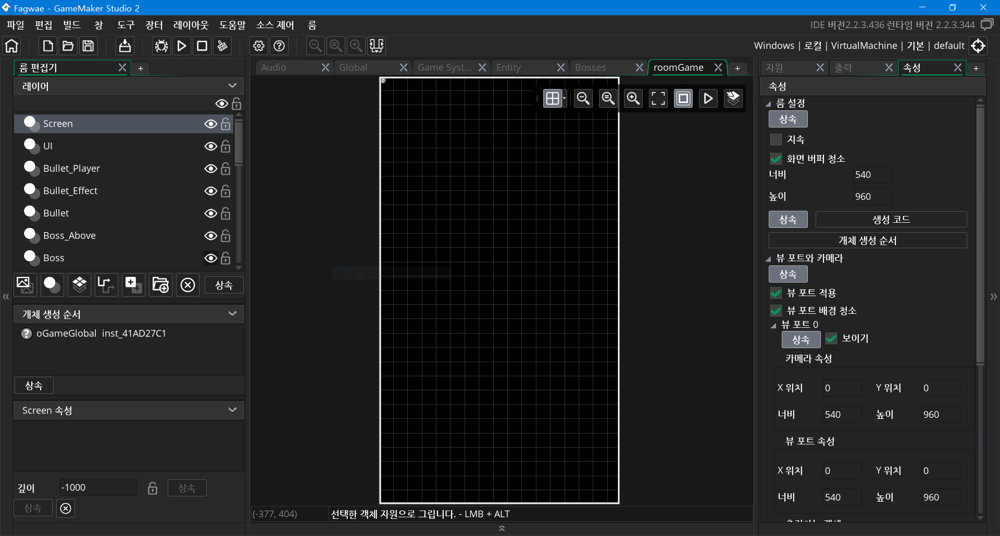

 2.2.3 버전 한글판 기준의 룸 편집기 사진입니다.

#### 레이어


 `GameMaker`의 룸은 **레이어**라는 구성 요소를 갖고 있습니다. 이 레이어는 층이라는 뜻을 갖고 있는데, 이름대로 층처럼 쌓여서 객체 들이나, 배경, 타일, 스프라이트 등이 놓일 높낮이를 정할 수 있습니다. 이 레이어는 자유롭게 더 추가할 수도, 지울 수 있습니다. **이 레이어는 수요가 있을 때마다 만드는 게 좋습니다.** 구분이 필요할 때 즉각 나누는 게 좋다는 말입니다. 게임을 제작할 때 구분해야 할 객체들을 구분하지 않고 한 레이어에 몰아넣으면 나중에 골치 아픈 문제가 발생할 가능성이 높습니다. 


 이 레이어를 레이어 목록에서 선택하면, 레이어 속성 창에서 그 안에 배치된 객체, 타일, 배경의 정보 등을 확인하실 수 있습니다.

#### 객체 배치

 모든 객체는 자기가 위치한 레이어가 있어야 하기 때문에 룸에 객체를 놓을 때에도 레이어를 정해줘야 합니다. 룸 속성의 레이어 목록에서 레이어를 하나 선택하면 됩니다. 그리고 자원 목록에서 놓을 객체를 선택하고, 룸 에디터 상의 원하는 위치에서 Alt키와 마우스 왼쪽 단추를 눌러 줍시다. 이렇게 하면 마우스 위치에 객체가 하나 배치되게 됩니다. 이렇게 배치된 객체의 목록은 룸 속성에서 확인하실 수 있습니다. 또한 객체를 지울 때는 객체 목록에서 선택해서 지우거나, 룸 상의 객체를 선택해서 Delete를 눌러 지울 수 있습니다.

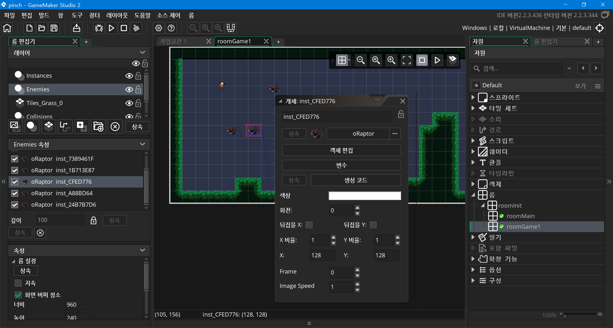

 룸에 객체를 놓을 때도 객체들의 속성을 지정해 줄 수 있습니다. 가령 image_angle, image_blend 등을 미리 정해줄 수 있습니다. 이렇게 하면 코드 편집기에서 내장 변수를 수정하고 실행하면서 번거롭게 결과물을 확인할 필요 없이 그냥 룸 편집기에서 바로 결과물을 확인할 수 있다는 장점이 있습니다.

 룸 편집기에 대한 설명이 이해가 잘 안되실 수 있습니다. 사실 `GameMaker`의 룸 편집기가 조금 불친절한 편입니다. 하지만 중요한 것은 차근차근 알아 가는 것, 그리고 항상 상황을 확인하는 것입니다. 레이어를 잘못 골라서 객체가 이상한데 놓였다면 레이어 목록을 뒤져볼 필요 없이 룸 상에서 객체를 직접 확인하면 됩니다. 작은 객체가 큰 객체 아래에 깔려서 안 보인다면 마우스로 드래그하여 선택해서 확인한 후에 레이어의 객체 목록을 확인하면 됩니다. 적어도 편집기 안에서 생긴 문제는 편집기 내에서 해결할 수 있습니다. 명심하세요.

## 빠른 개발을 위한 코딩 지식


 `GameMaker`는 독자적인 프로그래밍 언어를 사용합니다. 바로 `GameMaker Language (GML)`이라는 스크립트 언어입니다.  `GML`은 정말 간단하고 쉬운 언어입니다. `GameMaker`의 모토인 빠르고 간단한 게임 개발에 걸맞은 언어입니다. 통신과 모바일 분야에서는 문제 많은 확장 기능의 힘을 빌어야 하는 단점이 있지만, 그 외엔 아무 무리 없이 개발 진행이 가능합니다.

 게임메이커 언어는 스크립트 언어이기 때문에 느슨한 자료형, 자유로운 서식 등의 특징을 가집니다. 가령 어떤 변수에 0을 넣어도 "12"를 넣어도 어떤 객체를 넣어도 문제가 없습니다. 조건문에 괄호를 넣어도 되고 안 넣어도 되고, ;를 써도 되고 안 써도 됩니다. 참고로 저희 강좌에서는 쓰지 않습니다.

 프로그래밍을 따로 공부하신 분들께 미리 말씀드리자면, 이 언어는 *곧 추가되는* 함자와 프로토타입이 없는 걸 제외하면 자바스크립트와 꽤 비슷합니다. 오래전, `GameMaker`의 창조자 마크 오버마스가 다른 스크립트 언어 `Delphi (델파이)`에서 따와 만들었을 때부터 자바스크립트도 참고하지는 않았을 것 같습니다. 그때는 AJAX도 없었을 때니까요. 하지만 자바스크립트를 배우신 분이라면 비슷한 방식으로 코딩하실 수 있습니다.

### 변수

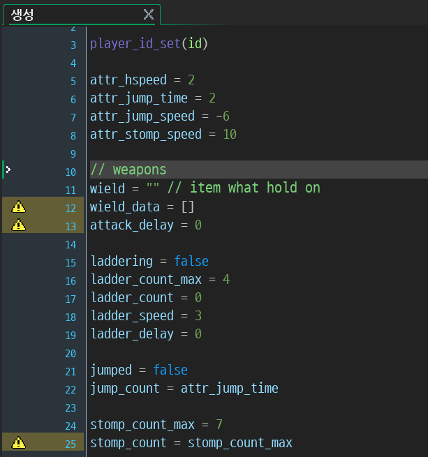

 주변의 사물을 보면 아시겠지만, 물체들은 떨어진다, 난다, 열린다 등 행동과 겉모습 외에도 딱딱하다, 무겁다, 어떤 작은 물체 여러 개로 이루어져 있다, 빛난다, 퍼져나간다, 무게, 크기 등의 속성을 갖고 있죠. 프로그래밍 언어에도 이런 객체마다 정보나 수치를 담고 있는 요소가 있습니다. 프로그래밍 언어에선 어떤 값들을 이름도 없이 아무 데나 두고 쓸 수 없습니다. 사용자의 목적대로 값들을 어떤 장소에 두고 써야 합니다. 이 변수가 그런 값들을 담는 항아리 같은 역할을 합니다. 이름은 **변하는 수**지만, 사용자가 다시 조작하지 않으면 변수에 담긴 내용은 변하지 않습니다. 

 `GameMaker`에도 마찬가지로 정보를 담을 수 있는 요소가 있습니다. 바로 **변수 (variable)**라고 부르는 요소입니다. 변수는 여러분이 마음껏 만들고 조작할 수 있습니다. 

 변수의 선언은 `variable = value`의 형태로 이루어집니다. 한번 선언하면 계속 남아있습니다. 하지만 특수한 경우를 제외하면 한 변수는 선언해 준 객체에서만 사용이 가능합니다. 주의하실 점은 변수 선언이 어떤 이벤트에서 됐다고 하더라도, 그 이벤트보다 먼저 변수를 사용하면, 변수 선언이 되지 않았다는 오류가 발생한다는 것입니다. 한 객체 내에서 두고두고 쓸 변수는 처음에 전부 선언하는 것이 좋습니다.

### 내장 변수

 모든 객체는 사용자가 만들지 않았지만, 미리 필요할 것 같은 변수를 선언해둔 것을 갖고 있습니다. 이런 변수들을 내장 변수 (Builtin Variable)라고 부릅니다. `GameMaker`에는 이런 변수들이 수백 개가 있습니다. 여러분이 도움말에서 직접 쓰임새를 찾아 쓰실 수도 있습니다.

#### 좌표

- `x: 실수`
- `y: 실수`

 이 두 변수는 룸 안에서 객체의 위치를 나타냅니다. 이 두 변수가 조합되어 객체의 위치가 정해지는 것입니다. 각기 따로 쓰면 그냥 숫자와 다를 것이 없습니다. 좌표는 음수거나 룸의 너비, 높이보다 커져서 아예 객체가 룸 밖으로 나갈 수도 있습니다. 즉 객체의 좌표에 제한을 두진 않습니다. 그래서 빠른 속도로 이동하는 총알 객체들은 룸 밖으로 나갈 수도 있습니다. 그런데 이렇게 눈에 보이지 않는 객체가 쌓이면 어떻게 될까요? 이에 관해서는 추후 강좌에서 알려드립니다.

#### 속도와 방향

- `speed: 실수`
- `direction: 실수`

 이 두 변수는 한 스텝마다 객체가 움직이는 속도와 방향을 나타냅니다. 예를 들어서 속도가 4라면, 일반적인 `GameMaker Studio 2` 설정에서는 1 초가 60 스텝이므로 초 당 240 픽셀을 이동합니다. 방향 direction은 오른쪽이 0 도부터 시작해서, 반 시계 방향으로 도는 체계를 갖고 있습니다. 두 값의 기본 값은 0입니다.

#### 각도

- `image_angle: 실수`


#### 크기


- `image_xscale: 실수`
- `image_yscale: 실수`


### 조건 분기

- `if condition { ... }`
- 조건 연산자 < > == <= >=

- `true=1`, `false=0`

  

- `condition ? value_true : value_false`

  

### Instance

 여러분은 지금까지 IDE에서 만든 자원 객체와 룸에 놓은 객체, 그리고 게임에서 활동하는 객체가 모두 같은 것이라고 생각하셨을 겁니다. 그러나 실제로는 그렇지 않습니다. 여러분이 이벤트와 코드를 작성하셨던 자원 객체는, 룸과 게임에 배치된 물건과는 구분되어야 합니다. 생소한 개념이지만 이렇게 객체를 실제로 동작하는 물체로 구체화한 (Instancing) 것을 `개체`, 내지는 `인스턴스 (Instance)`라고 부릅니다. 그럼 객체 (Object)와 개체 (Instance)의 차이는 무엇일까요? 그리고 왜 이런 구분을 하는 것일까요?

#### 객체 생성 및 제거

- `id: 개체의 주소`
- `instance_create_layer(x, y, layer, object)`
- `instance_destroy([id])`

### 참조

- . 참조
- `with instance { ... }`
- `other: id`

### 기타

#### 문자 출력

- `show_message(caption: 출력할 내용)`
  `show_message`는 `GameMaker`에서 간단하게 값이나 문자를 출력하는데 사용하는 함수입니다. 게임 내부에서 보여 주는 건 아니고, 게임 창 위에 메시지 창을 띄웁니다. 일반적으로는 값 확인이나 오류 및 버그 수정을 위해 사용합니다.

```js
// "Hello World!" 출력
show_message("Hello World!")
// "Is anyone there?" 출력
show_message("Is anyone there?")
// 12345 출력
show_message(12345)
```

 `show_message`는 메시지 창을 띄운 동안에는 게임을 일시 정지 시킵니다. 이를 이용하여 일시 정지에 이용할 수 있습니다. 하지만 더 좋은 방법이 있으므로 권장해드리지는 않습니다. 그리고 한번에 여러 개의 메시지를 띄우면 실행한 순서대로 순차적으로 띄웁니다.

#### 무작위 값

- random

- irandom

#### 두 지점 사이의 각도

- `point_direction(x1: 실수, y1: 실수, x2: 실수, y2: 실수)`
  `point_direction`은 점 (x1, y1)과 다른 점 (x2, y2) 사이의 각도를 반환합니다. `GameMaker`에서의 각도는 우측이 0도로 시작하여 반 시계 방향으로 돌아갑니다. 이를 이용하여 어떤 객체가 지정한 방향을 바라보게 하거나, 총알을 발사할 때 원하는 방향으로 날아갈 수 있게 해줍니다.

#### 게임 다시 시작

- `game_restart()`
  이 함수는 게임을 즉시 다시 시작합니다. 클라이언트 내용의 모든 것이 사라지고 처음으로 되돌아갑니다. 단순히 다시 시작의 용도 외에도, 게임에서 구현한 내용에 문제가 없는지, 어떤 내용을 반복 적으로 보고 싶을 때도 유용합니다.

#### 게임 종료

- `game_end()`
  이 함수는 게임을 즉시 종료합니다. 그렇지만 게임을 완수했거나 게임에서 패배했다고 덜컥 종료하면 별로 좋지 않습니다. 이 함수는 플레이어에게 좋지 않은 경험을 줄 수 있기에 적절한 결과 화면을 두는 게 좋습니다.

  주의하실 점은 모바일 플랫폼에선 정말로 게임을 종료하지 않는다는 것입니다. 그냥 게임을 최소화하고 대기 모드로 바꿀 뿐입니다. 자세한 사항은 도움말을 확인하세요.

## 예제

 이제 몇 가지 예제를 보여드리겠습니다. 프로젝트로의 구현은 여러분에게 맡깁니다.

### 간단한 문자 출력

```js
// 4개의 메시지를 연달아서 출력
show_message("순간 내 입속으로 들어간 구슬")
show_message("그리고 그 구슬은 내몸속으로 들어갔다.")
show_message("뭐...뭐야!!")
show_message("그건 불의기운을 가지고있는 제가만든 불의 구슬입니다 언제든지꺼낼수있습니다")

// 조건 분기를 활용한 다른 메시지 출력
if show_question("이 구슬을 사용하는 방법은 '불의 구'이다.") {
	show_message("난 역시 출근을했다.")
} else {
    show_message("아닌데요??..")
}

// 마지막 메시지 출력 이후 게임 종료
// \n 개행 문자를 이용하여 한 줄 띄우기를 할 수 있다.
show_message("이제자야지 \n-다음날-")
game_end()
```

### 여러 개의 객체 생성

```js
/*
	레이어 기반의 객체 생성.
*/
// "System" 레이어에 oGameGlobal의 개체 생성
instance_create_layer(0, 0, "System", oGameGlobal)
instance_create_layer(80, 390, layer, oBuilding)
instance_create_layer(220, 320, "Wall", oMountain).image_xsacle = 1.5

/*
	깊이 기반의 개체 생성. 사용하지 않는 것이 좋다.
*/
instance_create_depth(x, y, 10, oShadow)
```

### 총알을 쏘는 플레이어 oPlayer 구현

- 플레이어 객체 oPlayer와 총알 객체 oBullet이 필요합니다.

```js
/* oPlayer 생성 이벤트 */
reloaded = true

/* oPlayer 스텝 이벤트 */
// 플레이어가 마우스를 바라보게 만들기
image_angle = point_direction(x, y, mouse_x, mouse_y)

/* oPlayer 알람 0 이벤트 */
reloaded = true

/* oPlayer 마우스 왼쪽 누르기 이벤트 */
if reloaded {
    with instance_create_layer(x, y, layer, oBullet) {
        speed = 10
        direction = other.image_angle
    }
    
    reloaded = false
    alarm[0] = 5
}
```

### 레이어를 이용한 객체 구분

[IDE 내의 게임 자원 목록 사진]

[두 포탑 객체가 적에게 총알을 발사하는 게임 사진,  그림자가 있음]

 구현이 잘된 것 같아 보이는 디펜스 게임의 사진입니다. 그런데 뭔가 이상하군요. 게임의 동작이 아닌 시각적으로 뭔가 문제가 있어 보입니다. 그림자가 들쭉날쭉하고 표기되는 글자들이 포탑보다도 밑에 있습니다.

```js
// 원래 소스는 그림자, 총알과 적을 모두 같은 레이어에 생성한다.
with instance_create_layer(50, 100, layer, oEnemy) {
    speed = 2
    direction = 270
}

with instance_create_layer(x, y, layer, oBullet) {
    speed = 8
    direction = other.image_angle
}

with instance_create_layer(x, y, layer, oShadow) {
    sprite_index = sShadowTurret
    parent = other.id
}
```

 여러 객체에서 사용하는 코드를 모은 것입니다. 상단의 코드에서 알 수 있듯이 모든 `instance_create_layer` 함수들이 같은 레이어를 사용하고 있습니다. 왜냐하면 적을 만드는 시스템 객체, 총알을 발사하는 포탑 객체, 그림자를 만드는 모든 객체들이 룸에서 같은 레이어에 놓여있었기 때문입니다.

[룸에 레이어 여러 개를 만든 사진]

 모든 객체 종류별로 레이어를 분화합니다. 이 예제에서는 "System", "Turret", "Enemy", "Bullet", "Shadow", "Background" 순으로 나눴습니다. 그리고 시스템 객체를 "System" 레이어로 옮겨 주고, 포탑 객체를 "Turret" 레이어로 옮겨 주어야 합니다. 그런데 룸에서만 객체를 옮긴다고 문제가 해결되는 것은 아닙니다. 여러분이 이렇게 고치고 실행을 해보시면, 여전히 그림자 일부가 이상하게 보이는 문제가 있을 겁니다. 코드에서 사용되는 레이어도 고쳐 주셔야 합니다.

```js
// 이제 그림자, 총알, 포탑, 적 모두가 다른 레이어에 있다.
with instance_create_layer(50, 100, "Enemy", oEnemy) {
    speed = 2
    direction = 270
}

with instance_create_layer(x, y, "Bullet", oBullet) {
    speed = 8
    direction = other.image_angle
}

with instance_create_layer(x, y, "Shadow", oShadow) {
    sprite_index = sShadowTurret
    parent = other.id
}
```

[실행해서 각 객체들이 구분된 사진]

 완성되었습니다.